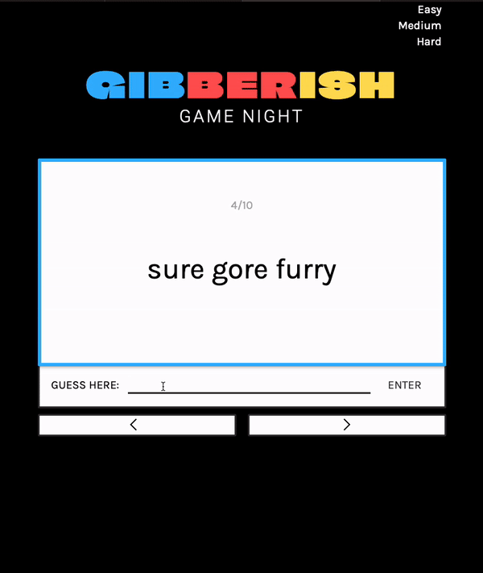

# Web Development Project 3 - *Gibberish Flashcard Game Night*

Submitted by: **Charidi Stevens**

This web app: **Gibberish Flashcard Game Night** is a flashcard app inspired by the card game Incohearent!

Deployed Application: [Gibberish Game Cards Deployed Site](https://gibberishgamecards.netlify.app/)

Time spent: **6** hours spent in total

## Required Features

The following **required** functionality is completed:

- [x] **The user can enter their guess in a box before seeing the flipside of the card**
- [x] **Clicking on a submit button shows visual feedback about whether the answer was correct or incorrect**
- [x] **A back button is displayed on the card and can be used to return to the previous card in a set sequence**
- [x] **A next button is displayed on the card and can be used to navigate to the next card in a set sequence**

## Video Walkthrough

Here's a walkthrough of implemented user stories:

## License

    Copyright [2023] [Charidi Stevens]

    Licensed under the Apache License, Version 2.0 (the "License");
    you may not use this file except in compliance with the License.
    You may obtain a copy of the License at

        http://www.apache.org/licenses/LICENSE-2.0

    Unless required by applicable law or agreed to in writing, software
    distributed under the License is distributed on an "AS IS" BASIS,
    WITHOUT WARRANTIES OR CONDITIONS OF ANY KIND, either express or implied.
    See the License for the specific language governing permissions and
    limitations under the License.
